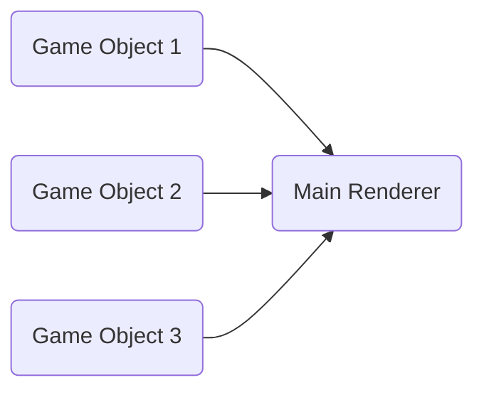

## About

This module provides live coding in pygame.You can see your code changes at once without restart application.

> **Note:** Your Game should be implemented OOP style.
## Example Game

Example game (FlappyDooM) is made by Stanislav Petrov [StanislavPetrovV](https://github.com/StanislavPetrovV). 

You should design your game like this to work PygameLive properly(highly recommended to look up example folder):

> **Note:** PygameLive only can be used for your main **draw**, **update**, **event** handler methods.